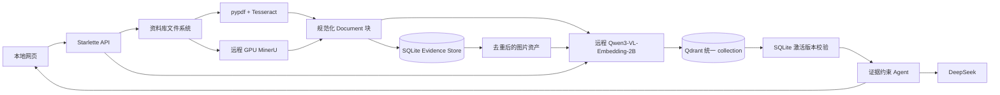

# 科研文献与计划助手项目技术报告

## 1. 报告信息

- 项目路径：`D:\workspace\research_assistant`
- 报告日期：2026-09-09（评测快照时间使用 UTC；历史实验保持原日期）
- 当前阶段：本地科研资料管理、多模态证据检索、结构化表格、质量评测和有界多 Agent 文献对照；研究计划保留现状，暂缓重构
- 当前状态：统一 Qwen 链路、结构化表格、固定开发评测及检索上下文改进已完成；新文献对照见第 22 节，同批检索候选对照见第 20 节，历史模型诊断见第 12 节。科研质量尚未通过独立验收。连贯的整体介绍见 `项目介绍.md`。

## 2. 项目摘要

本项目是一个面向个人科研工作的本地证据型 Agent。它解决的不是普通聊天问题，而是把用户自己的 PDF、Markdown 和 TXT 资料转化为可追踪证据，再让模型依据这些证据回答问题或制定研究计划。

系统的核心原则是“检索与生成分离”：解析器负责恢复文档结构，嵌入模型负责召回，SQLite 负责证据真相和版本状态，Qdrant 负责向量近邻搜索，DeepSeek 只负责基于已经选出的证据组织答案。这样可以分别定位解析错误、检索错误和模型生成错误。

默认多模态后端只使用 `Qwen/Qwen3-VL-Embedding-2B`。资料文字、图片与其原有图注、用户问题都通过同一组多模态模型权重，输出 2048 维向量。图片和图注一起参与一次模型前向计算，不是先生成描述再由另一模型向量化。文字点和图片点保存在同一个 Qdrant collection，问题只编码一次并执行一次搜索。

BGE 保留为独立的纯文字基线，不参与默认多模态检索。共享空间提供可比较的坐标体系，但不自动消除模态偏差；模型选型必须配合真实检索实验。

后续新增研究项目工作台，补足单次 RAG 之外的执行状态、项目记忆、任务依赖和人工审批。它使用有界 LangGraph 工作流生成新增任务建议，审批后才落入本地任务清单；不自主执行实验。详见第 21 节。

## 3. 项目目标与边界

### 3.1 已实现目标

- 用户可自行上传、选择和删除本地科研资料。
- PDF 可走快速解析，也可通过 SSH 隧道调用远程 GPU MinerU 精析。
- MinerU 的文字、标题、列表、表格、图片、公式、页码和 bbox 被保留下来。
- 文档块与图片向量持久化到 Qdrant，服务重启后不需要重复编码未变化内容。
- SQLite 保存规范化证据、内容哈希、模型信息与激活版本。
- 用户问题可以联合召回文字和图片证据。
- Agent 基于固定的一次检索生成答案或计划，并返回结构化引用。
- 外部模型不可用时，本地检索仍可独立工作。

### 3.2 当前不在范围内的能力

- 不训练或微调基础模型。
- 不替代研究者对关键图表、公式和临床结论的人工核验。
- 不把 Qdrant 当作文档原件仓库；原始 PDF 和 MinerU 图片仍保存在文件系统。
- 最终生成模型目前不直接读取图片像素。视觉模型负责找图；默认统一路径向 DeepSeek 传递正文、表格文字和出处，对图像仅传定位及风险提示，不传未核验图表转写正文。
- 当前没有跨用户权限系统，网页仅设计为本机单用户工具。

## 4. 总体架构



系统跨越本机和远程服务器，但数据边界明确：

- 本机保存原始资料、MinerU 产物、SQLite 和 Qdrant。
- 远程服务器运行 MinerU（GPU 1/30000）及独立 Qwen 嵌入服务（GPU 2/30001），均通过 SSH 转发访问。
- DeepSeek 只有在用户明确允许后才接收命中的文字证据。
- Qdrant 的 6333/6334 端口只绑定 `127.0.0.1`。

## 5. 端到端数据流程

### 5.1 资料进入系统

网页上传接口把文件写入 `library/`。系统只接受 PDF、Markdown 和 TXT，并限制单文件大小。文件名会经过路径约束，不能用 `../` 操作资料库外的文件。

上传、删除或 MinerU 精析完成后，内存中的 `LiteratureIndex` 会失效。下一次检索按资料库签名重新加载文档。

### 5.2 PDF 解析

快速路径使用 `pypdf` 逐页提取原生文字。当页面文字较少且本机 OCR 工具可用时，才尝试 `pdftoppm + Tesseract`。这条路径速度快，但不能恢复复杂版面。

精析路径使用 `MinerUExtractor`：

1. 本机通过 `127.0.0.1:30000` 访问 SSH 隧道。
2. 远程 RTX 3090 上的 MinerU VLM 处理 PDF。
3. 本机客户端保存 `content_list.json`、Markdown、布局结果和图片。
4. 项目按 PDF 内容哈希缓存结果。
5. `content_list.json` 转成 LangChain `Document`，保留页码、bbox、内容类型和图片路径。

MinerU 图片相对路径在进入 Evidence Store 前会转换为绝对路径。网页不会直接暴露这个本地路径，而是通过受控图片接口读取。

### 5.3 切块

规范化文档按 450 字符窗口切分，重叠 80 字符。该规则是之前短上下文模型阶段留下的全后端共用基线，不是 Qwen 的模型能力上限。每个块继承来源、页码、解析方法、内容类型、bbox 和图片路径，并增加 `start_index`。Qwen 服务目前配置 8192 token 上限；后续可研究章节、完整表格等语义切分。

固定字符窗口简单且稳定，但并不理解章节语义。它是当前版本的可解释基线，不是最终最优切块方法。

### 5.4 Evidence Store 写入

`research_assistant/storage/evidence_store.py` 使用 SQLite 保存规范化证据。SQLite 是证据状态的权威来源，Qdrant 不是。

主要表如下：

| 表 | 作用 | 关键字段 |
| --- | --- | --- |
| `documents` | 保存每份资料当前激活版本 | `document_id`、`source`、`active_version` |
| `evidence` | 保存文字证据块 | `evidence_id`、`page`、`bbox_json`、`text`、`content_hash`、模型与维度、`active` |
| `visual_assets` | 保存去重图片资产 | `visual_id`、`image_path`、`image_hash`、`caption`、视觉模型与维度、`active` |
| `schema_meta` | 保存数据库结构版本 | `schema_version` |
| `index_state` | 各 collection 的来源同步检查点 | `index_name`、`source`、`evidence_version`、`point_count` |

SQLite 使用 WAL 日志模式。每个操作使用短连接，并在提交或回滚后显式关闭，避免 Windows 文件锁长期占用数据库。

### 5.5 统一多模态向量入库

默认嵌入模型是 `Qwen/Qwen3-VL-Embedding-2B`：

- 使用官方 `Qwen3VLEmbedder` 的处理器、最后有效 token pooling 与 L2 归一化；不自行设计 pooling。
- 资料文字输入 `text`；图片输入像素及 MinerU 原有 caption，官方 helper 一次处理联合输入。
- 普通问题使用英文任务指令：`Given a search query, retrieve relevant text passages, figures, or tables from scientific papers.` 明确包含图片、图表、流程图、示意图、image/figure/diagram/flowchart 等视觉词的问题，使用 `Retrieve an image that matches the given description.`
- 指令选择是可见的确定性关键词规则，只改变同一模型的任务提示，不调用分类模型、不先生成回答、也不执行第二次搜索。它不是完美意图识别；隐含找图意图可能漏判。
- 资料采用默认 `Represent the user's input.`；这是查询/候选角色的区别，不是独立模型或两阶段编码。
- BF16 推理，返回 2048 维浮点向量；客户端检查数量、维度、有限数值、范数后再入库。
- 权重离线保存在指定远程服务器；每批最多 4 项，图像预处理上限 1048576 像素。
- 每次响应校验模型指纹；指纹或维度改变则拒绝使用当前索引。新指纹产生新 collection，不覆写旧模型集合。

每份文档的索引版本由下列信息共同决定：

- 解析后的全部块正文和元数据
- 切块规则版本
- 嵌入模型名称
- 向量维度

规范化文档版本只由内容、元数据及切块规则决定；模型身份位于 collection 名和对应 index_state 中。SQLite evidence 内的历史模型字段不能作为当前向量空间的唯一依据，实际以 collection/payload/服务指纹为准。只有文档版本、索引状态和实际点 ID 都一致时才跳过编码；因此恢复了空 Qdrant 后仍能自动重建。

### 5.6 图片资产入库

一张 MinerU 图片可能被多个重叠文字块引用。Evidence Store 按“文档 ID + 图片路径”去重，聚合关联文字作为 caption（最多 4000 字符）。图片版本包含模式版本、文档 ID、图片 SHA-256、文档版本与 caption；模型指纹由 collection 隔离。相同 PDF 的不同副本不会丢失来源。payload 中 `modality=image` 表示包含图片的联合证据，不意味着只使用裸像素。

## 6. 一致性与增量更新设计

SQLite 与 Qdrant 不能共享一个数据库事务，因此项目采用“暂存、写向量、激活、清旧”的顺序：

1. 新证据先以 `active=0` 写入 SQLite。
2. 所有新向量成功写入 Qdrant，并等待写入完成。
3. SQLite 在单个事务内停用旧版本并激活新版本。
4. 最后删除 Qdrant 中旧版本的点。

查询 Qdrant 后，系统还会拿命中 ID 回 SQLite 检查 `active=1`。因此即使进程在步骤 2 或步骤 4 中断，用户也不会同时看到新旧两个文档版本。

图像命中还要关联 documents 当前激活版本。文本按文档激活、视觉资产在全部处理后发布，两者并非全库原子事务；中断期间可能暂时少图，但不会把上一版图片作为当前证据返回。每次 Qdrant 写入最多 96 点，避免请求体超过服务限制。只有完整 sync 成功后，应用才发布索引实例。

## 7. 检索算法与质量边界

问题先做已有中英文术语扩展，再由 Qwen 生成一个查询向量 q。所有候选向量 d 使用相同权重及输出空间。Qdrant 按 cosine(q, d) 排序；向量归一化后等价于点积。数据库内对来源、文件类型、模型身份和维度过滤，应用再校验证据激活状态。

统一路径没有 BGE/CLIP 分数加权、RRF 或额外重排模型。当前使用 `research-context-v2` 对同一次检索的候选过滤明确页眉/页脚/页码、排除未核验的图表纯文字转写点、补回同块上下文并合并重复内容，不再限制每来源最多 3 条。旧 cap3 规则冻结为历史比较基线；其他检索后端未改动。相似度不是答案正确率，默认阈值 0.35 是当前工程参数，不是经标注数据校准的置信度。实现与取舍详见第 20 节。

选型实验发现：ChineseCLIP 全库图表问题的前 250 条没有图片；Qwen 裸图片也存在分数偏低。图片与原有图注联合编码、查询增加科研检索指令后，抽样流程图召回明显改善。任务指令改变表示目标，因此需要纳入版本标识。六条诊断问题不等于正式评测集，不能据此宣称通用准确率。

## 8. Agent 如何使用检索结果

`build_agent()` 创建的是受控 RAG 执行器，并非让模型无限循环选工具：固定检索一次，把来源、页码和片段整理成证据消息，DeepSeek 生成 `ResearchResponse`。其主要字段为 mode、summary、citations、tasks；计划任务结合研究主题、每周工时和任务依赖。

结构化解析失败时最多再请求一次普通文本回答；仍无可用输出时返回本地证据摘要。网络、余额、鉴权等错误由 API 分类返回。固定执行边界是针对历史反复检索和超时问题的设计取舍，不具备自动联网找新论文、多 Agent 辩论或自主长期执行实验的能力。

生成模型目前看不到图片像素。默认统一路径会将图像证据正文置空，仅附来源、页码、模态和风险提示；原转写保留在网页折叠项供核对，不进入 `format_results()` 生成消息。表格文字仍可进入模型，但附有数值及单位未经核验提示。能找到图不等于能读准图中的数值；重要结论必须回看原 PDF。引用目前主要通过提示词约束，并未实现逐条引用的严格自动事实校验。


## 9. Web 服务与接口

`web_app.py` 使用 Starlette，计算密集的索引和 Agent 调用放在线程池，避免阻塞异步 HTTP 事件循环。

主要接口：

| 接口 | 方法 | 作用 |
| --- | --- | --- |
| `/api/status` | GET | 模型、资料数、MinerU、Qdrant collection 和 Evidence Store 状态 |
| `/api/library` | GET/POST | 列出或上传资料 |
| `/api/library/{path}` | DELETE | 删除资料及关联缓存 |
| `/api/search` | POST | 只执行检索，不调用 DeepSeek |
| `/api/run` | POST | 执行检索后生成回答或计划 |
| `/api/pdf-parse` | POST | 启动 MinerU 后台精析任务 |
| `/api/pdf-parse/{job_id}` | GET | 查询精析任务状态 |
| `/api/pdf-reports` | GET | 查看 PDF 解析质量报告 |
| `/api/evidence-image/{visual_id}` | GET | 读取已激活且位于 MinerU 缓存内的图片 |

图片接口不会接受任意文件路径。它先通过 `visual_id` 查询激活记录，再检查文件位于项目 `.cache/mineru` 下，从而避免把本机其他文件暴露给浏览器。

## 10. 故障回退

| 故障 | 系统行为 |
| --- | --- |
| MinerU 不可用 | 未精析 PDF 回退到 `pypdf + Tesseract`；已有缓存继续可用 |
| Qwen 服务、隧道或统一索引初始化不可用 | `multimodal-fallback-tfidf`，明确退回本地字面检索 |
| Qdrant 不可用 | 纯文字后端使用 `qdrant-fallback-bge`；统一多模态后端使用 `multimodal-fallback-tfidf` |
| DeepSeek 不可用 | 只检索仍可用；生成接口返回明确的连接、鉴权、限流或余额错误 |
| LangSmith 不可用 | 默认关闭，不影响主流程 |
| 结构化输出失败 | 调用一次普通文本模型，再失败则返回本地证据 |

降级后 API 会返回 `effective_backend` 和 `warning`，网页不会把回退结果伪装成目标后端。

## 11. 隐私与安全边界

- Web、Qdrant 和远程 MinerU 的本地入口都绑定回环地址。
- 远程 MinerU 服务同样只监听远程回环地址，通过 SSH 隧道访问。
- Qwen 只接受文字及 base64 图片字节，不接受任意文件路径/远程 URL；HTTP 请求上限 24 MiB，客户端单张图片上限 4 MiB。模型进程串行执行 GPU 推理，不记录正文。
- 嵌入步骤会把资料文字及图片发送到用户授权服务器；这不是完全本机离线计算。服务只面向可信本机/远程同机用户，尚无独立 API 鉴权，不可直接公网暴露。
- 调用 DeepSeek 前必须由用户勾选外部发送许可。
- API Key 只从 `.env`/环境变量读取，不写进代码、日志或项目报告。
- 图片接口使用数据库 ID 和缓存根目录检查，不能直接读取任意绝对路径。
- 上传文件名经过 `Path.name` 和资料库范围校验。

当前 Web 服务没有账号、会话和 CSRF 防护，因此只能作为本机单用户工具，不应直接开放到局域网或公网。

## 12. 实际数据与验证结果

2026-09-06 完整资料库验收，3 份资料；结果文件为 `benchmarks/unified_qwen_results.json`。

| 指标 | 实测值 |
| --- | --- |
| 模型 | Qwen/Qwen3-VL-Embedding-2B |
| 统一 collection | research_assistant_multimodal_v1_2048_78a89162b0 |
| 向量维度 | 2048 |
| 文字点 / 图片联合点 | 4037 / 132 |
| collection 精确总点数 | 4169 |
| 默认路径加载 BGE | 否 |
| 完整构建耗时 | 298.88 秒（不含权重下载） |
| GPU 2 迁移后的网页单次检索 | 1.36 秒（一次实测，非性能基准） |
| 复用已有索引初始化 | 4.38 秒 |
| 二次同步 | 文字跳过 4037、图片跳过 132、新编码 0 |
| 离线回归 | 24 项通过 |

部署验收发现 CUDA 与 nvidia-smi 的编号排序不同，首次建库测时嵌入进程曾与 MinerU 共用物理 GPU 1。随后改为按 UUID 绑定物理 GPU 2，MinerU 原 PID 未改变；Qwen 新进程加载后占用约 4320 MiB，之前完整推理后的驻留占用约 6006 MiB，不能把这两次快照当作峰值显存需求。GPU 2 独立运行后的网页检索仍同时返回文字和图片，模型指纹不变，无需重建向量。

切块后的内容类型包括 text 1447、list 1112、header 625、table 519、page_number 167、image 63、ref_text 59、aside_text 29、footer 10、equation 4、chart 2。584 条文字证据关联图片，3987 条带 bbox。这是切块后统计，不等于原 PDF 中的独立表格或图片数量。

完整库、不限制模态的一次 Qdrant 查询结果：

| 诊断问题 | 首个图片点排名（前 100 范围内） | 网页前 5 条含图片 |
| --- | ---: | --- |
| 论文中的医学流程图 | 2 | 是 |
| medical flowchart figure | 2 | 是 |
| 心脏结构示意图 | 60 | 否 |
| 胸部X光片 | 26 | 否 |
| 临床试验结果图表 | 未出现 | 否 |
| 心衰是什么 | 未出现 | 否（普通文字问题） |

流程图问题命中《Guideline for the Management of Heart Failure.pdf》第 47 页，已人工查看图像，确为心衰治疗流程图；图片分数约 0.5305，对应文字约 0.5661。网页端 `/api/search` 返回 `multimodal-unified`，没有降级；浏览器图片自然宽度 1334 像素，证据图确实加载。Playwright 验证了桌面与手机显示；检查过程中发现中等窗口宽度的四列筛选栏溢出，已调整断点。

这些诊断问题没有逐题标注真值，其中有些请求的图像在资料库里未必存在。排名不是 Recall@K，也不能把“返回一张图”当作正确。当前只能确认统一链路和流程图正例有效，不能宣称所有模态偏差已经解决。文字结果仍可能偏好标题、参考文献或相近主题，需后续质量评测和切块清理。

回归覆盖同一嵌入对象的文字、联合图像和问题编码；一次 query_points；内容更新；重复同步；空内存库恢复；共享图片的来源归属；旧文档图片不可访问；同步失败不发布半成品；远程模型、维度、数值与归一化校验；以及既有 PDF/OCR、Agent 与 API 错误分支。未将真实文献发送给 DeepSeek。

## 13. 主要文件职责

| 文件 | 职责 |
| --- | --- |
| `web_app.py` | HTTP API、后台任务、缓存失效、错误分类、图片访问控制 |
| `research_assistant/retrieval/knowledge_base.py` | 文档加载、切块、五种检索后端和统一多模态入口 |
| `research_assistant/storage/evidence_store.py` | SQLite schema、证据版本、视觉资产和激活状态 |
| `research_assistant/retrieval/qdrant_index.py` | 文字 collection、增量向量入库和查询 |
| `research_assistant/retrieval/unified_index.py` | 单模型、单 collection 的文字/图片增量入库和一次查询 |
| `research_assistant/retrieval/embeddings/local_embeddings.py` | 可选的本地 BGE 纯文字基线 |
| `research_assistant/retrieval/embeddings/remote_embeddings.py` | Qwen 统一客户端、批处理、模型指纹与向量校验 |
| `deployment/embedding/remote_embedding_service.py` | 私有 Qwen 推理服务，调用官方 helper |
| `deployment/embedding/start_remote_embedding.py` | 远程服务启动及校验 PID 归属后的重启 |
| `scripts/start_embedding_tunnel.ps1` | 独立 SSH 嵌入端口转发 |
| `research_assistant/retrieval/embeddings/local_visual_embeddings.py` | 保留的 ChineseCLIP 实验基线，不参与默认路径 |
| `research_assistant/ingestion/mineru_extractor.py` | 远程 MinerU 客户端、缓存和结构块转换 |
| `research_assistant/ingestion/pdf_extractor.py` | pypdf 与 Tesseract 快速回退 |
| `research_assistant/agents/research_agent.py` | 确定性 RAG、DeepSeek 生成和降级 |
| `research_assistant/core/models.py` | Agent Runtime Context 和结构化响应模型 |
| `tests/test_core.py` | 不依赖外部模型的核心回归测试 |

## 14. 当前限制与技术风险

1. Qwen 的共享空间仍有模态偏差，任务指令和图文联合输入只能改善，不能保证所有图片问题都进入 Top-K。已建立开发评测集及人工审阅机制（第 18 节），但尚无真实人工评分或独立测试集，不得把草案指标当成最终基准。
2. 向量相似度无法证明模型准确读取坐标轴数值或表格单元格，也不是答案置信度。
3. 图片点只覆盖 MinerU 实际导出的图片。快速解析路径只统计图片数量，不生成可检索图片资产。
4. 固定字符切块可能拆开章节语义；同原始块补全只能缓解，不能跨页/跨块重建论证，长表格 HTML 仍可能截断。
5. 模型权重、关键预处理及 helper 已用 SHA-256 指纹隔离，但远程基础环境仍复用现有 torch/transformers，并非完整容器化锁定；升级环境后应重新验收。
6. GPU 建库仍需分钟级时间，当前初始化同步执行。首次大库请求可能占用工作线程；服务器开机后需重启嵌入服务和本机 SSH 隧道，尚未配置 systemd 托管。
7. SQLite 与 Qdrant 通过应用层协议保持一致，不是严格的分布式事务；激活校验保证查询正确，但异常暂存记录仍可能等待下次同步清理。
8. 当前生成模型只消费文字证据，尚不能对图片进行第二阶段视觉推理。
9. 统一索引初始化失败会明确回退 TF-IDF；已缓存实例在运行中断线或模型变更时会报错，不能把它当作已经实现完整自动故障恢复。服务恢复后必要时重启网页，避免长期保留降级缓存。
10. 图像 caption 来自解析输出，并非独立标注；错误 OCR 或不完整图注会影响联合向量。当前单图超过 4 MiB 会拒绝而非静默压缩，防止未经核验的细节损失。

## 15. 后续建议

下一阶段应优先提高质量，而不是继续堆叠框架：

1. 由助手辅助整理和初审，研究者抽样核对及确认关键证据；补全等价证据需新建数据集版本，再以新文献建立独立测试集，避免在当前 18 题上反复调参。不是要求逐条标注日常问题。
2. 同源限制已在统一路径移除，见第 20 节；继续研究混合证据完整性、近主题负例和可回答性校准，保留固定自动回归。
3. 在已完成的单元格存储与只读 SQL 基础上，增加表头语义、单位及数值抽取准确性评测，再考虑自动 SQL Agent。
4. 对高价值视觉命中增加可选 VLM 二次解析，让模型回答坐标、趋势和局部细节问题。
5. 建立完整运行环境锁定和依赖升级验收，补充远程服务托管与访问鉴权。
6. 为索引任务增加后台进度与取消功能，避免大资料库首次编码占用前台请求。

## 16. 结论

项目已经从“能读取 PDF 的聊天页面”演进为有明确数据边界的科研证据系统。MinerU 提供结构化内容，SQLite 管理证据和版本，远程 Qwen 把文字、图片和问题映射到统一空间，本机 Qdrant 在一个 collection 中执行一次检索，DeepSeek 只在最后一步组织答案。

这满足单模型、单空间、单次搜索的架构目标，但不能据此声称科研问答已经可靠。当前已增加可复现评测、结构化表格、AI 辅助初审和证据上下文补全；日常无需标注，开发阶段用固定自动回归，关键科研结论仍需抽样或针对性核验。后续重点是混合证据、拒答校准、跨块结构与图表细节准确性。

## 17. 参考与复现依据

- 官方模型卡：https://huggingface.co/Qwen/Qwen3-VL-Embedding-2B
- 官方实现：https://github.com/QwenLM/Qwen3-VL-Embedding
- 技术报告：https://arxiv.org/abs/2601.04720
- 实测程序：`benchmarks/evaluate_unified.py`；结构化结果：`benchmarks/unified_qwen_results.json`。
- 远程本次基础环境：torch 2.10.0、transformers 4.57.6；新增 qwen-vl-utils 0.0.14 独立安装到项目目录，没有升级 MinerU 环境的包。
- 原始权重下载源为 ModelScope 的 Qwen 官方模型仓库；服务启动时计算权重与关键文件摘要，报告结果记录派生索引指纹。服务工作期间不会访问模型下载站。

## 18. 多模态评测与结构化表格阶段

本节保留首次基线实验的设计与结果；其中 cap3 展示规则已在后续阶段替换，当前规则与结果见第 20 节。

### 18.1 本阶段要回答的问题

统一模型保证向量可以比较，却不保证完整科研证据出现在前几条。本阶段把“能返回内容”拆成三个可验证目标：是否召回指定证据、是否定位到正确 PDF 页面、以及证据是否经人判断为有用。与此同时，表格作为行列关系而不是一串 HTML 字符进入独立数据库，使数值查询不再依赖模型从截图猜测。

本阶段没有修改模型权重、切块策略、原 collection 或问答生成流程。这样首轮实验测的是原有系统，而不是在见到答案后调过的检索器。新增 `/lab` 是评测与表格工作区；问答页的表格命中也提供入口。非 PDF 文档以纯文本打开，PDF 链接使用物理页码，避免印刷页码 e274 与 PDF 第 12 页混淆。

### 18.2 数据集和证据单位

`benchmarks/multimodal_eval_v1.json` 包含 24 个案例：18 个开发正例，2 个无答案对照，4 个图像输入功能检查。18 个正例按期望证据分为文字、图像、混合三组，各 6 个；这些题的输入均是自然语言，包含中英文表述。另 4 题实际发送纯图片或图文联合输入，复用库内图像，属于自匹配检查，不纳入泛化检索结论。

`query_type` 表示要找什么证据，`input_modality` 表示实际给模型什么输入，这两者不能混用。图像问题包括流程图、专家模型架构、标签分布柱状图、指南分期图及诊断图；混合问题同时要求图/表与对应方法文字。开发集覆盖两份 PDF，而完整检索库仍包括第三份 Markdown 资料，不通过来源过滤降低难度。

每条期望证据记录 source、PDF page、原始 MinerU block_index、bbox、文字锚点、模态和 `any_of` ID 列表。重叠切块中具有同一证据的 ID 属于一个等价组，命中任意一个只计算一次召回。混合问题通常有两个独立组，不能因为找到一张图就判为完整命中。当前等价组由源块锚点匹配生成，可能仍有未列入的合理替代片段，必须在人工审核时补全。

题目和目标块先从原始文档选择，再运行被测检索器，不用检索 Top-K 反推金标准。按 PDF 技能渲染并检查了 Dementia-Agents 的 2/4/6/7 页和心衰指南的 12/16/47 页，核对图表与页码；这是助手检查，**不是人工相关性标注**。所有题标记 `assistant_seed`、`draft`。

### 18.3 版本与执行流程

评测集保存整库源文件 SHA-256、激活证据 ID/版本摘要与点数。运行前校验整个快照和每个目标 ID，图像输入还校验缓存范围及图片哈希；目标缺失、资料改变、集合未同步或回退 TF-IDF 都会拒绝本次评测，而不是跳过失败题后算平均。

每题使用原问答路径的确定性查询扩展，通过同一 Qwen 实例编码一次，在同一个 Qdrant collection 中检索。文字输入使用现有任务指令；图片输入以图片字节传输，混合输入把文字与图片放在同一个输入项中，单次前向，不合并两套模型的分数。纯图片请求省略空 `text` 字段，符合服务端校验。

评测取 200 个候选，保留原始前 10 名，并从同一候选序列应用默认 0.35 阈值、每来源最多 3 条，产生网页 K=10 的显示结果。运行中不调用 DeepSeek。结束后再次校验资料快照，成功才写入 `.data/evaluations.sqlite3` 的不可变 `runs` 记录。网页使用后台任务返回进度，失败不会存为完整运行；CLI 同时生成带 run_id 的 JSON 导出。

运行元数据包括 dataset_hash、corpus、模型完整标识、编码器指纹、维度、collection、K、候选上限、阈值、同源限制和耗时。人工评分独立保存，不改写原始排名。历史结果可以浏览和导出，不必重复调用 GPU。

### 18.4 指标定义与人工审阅

对每道正例，`Recall@K = Top-K 命中的期望证据组数 / 全部期望证据组数`。先逐题计算，再在文字/图片/混合组内取宏平均，不能把两个证据组的题当作两道简单题。`MRR@10` 是前 10 名第一个相关证据排名的倒数，没找到为 0；它只反映首次命中，不能反映混合证据完整性。

页码召回以 `(source, PDF page)` 为单位去重，单独计算 PageRecall@K。命中同页标题或参考文字能提高页码指标，却未必包含答案，所以页码召回不能替代证据召回。无答案题没有 Recall 分母，单列“仍返回证据的题数”，而不是按 0 或 1 混进正例均分。

人工评分等级为 0 无关、1 弱相关、2 有用、3 直接证据。页面不会预选 0 分，必须填写审阅人并主动保存。按每个 run/case/point 保存当前裁定分数、审阅人、备注、时间；重复提交覆盖该点当前分数，目前不是多审阅者一致性研究，也不是完整审计日志。

人工统计同时显示已评证据的平均等级、等级至少 2 的比例、已评/返回数量及覆盖率。未评的证据不当作 0，不把局部高分冒充全部结果质量。“确认标准答案”与“评分检索结果”是两个操作；确认按 dataset_hash/case 绑定，数据集改版后不会继承。人工确认的开发题与全部草案题分别汇总，自匹配检查也单列。

### 18.5 第一轮结果与判断

2026-09-06，run_id `b3d27727-e819-4ba2-b77b-ba7010cab8e9`；24 个案例检索阶段耗时 6.19 秒，不含初始化，只有一次运行，不能视为性能分位数。完整指标见 `benchmarks/多模态检索评测报告.md` 和对应 JSON。

| 期望证据 | 题数 | 原始 Recall@5 | 原始 Recall@10 | 原始 MRR@10 | 显示 Recall@10 | 显示 MRR@10 |
| --- | ---: | ---: | ---: | ---: | ---: | ---: |
| 文字 | 6 | 66.7% | 100.0% | 0.389 | 50.0% | 0.306 |
| 图片 | 6 | 66.7% | 100.0% | 0.422 | 50.0% | 0.333 |
| 混合 | 6 | 41.7% | 50.0% | 0.667 | 41.7% | 0.667 |
| 宏平均 | 18 | 58.3% | 83.3% | 0.493 | 47.2% | 0.435 |

原始 PageRecall@10 为 100%，但混合证据 Recall@10 只有 50%，说明“找到了正确页”与“找到了所需图文证据”差别很大。混合题 MRR 看似较高，仍可能只找到一类证据。

原始已命中目标的分数均高于 0.35，但同文献前面有其他结果占满三个名额，导致文字与图片组显示召回都降至 50%。代码中的同源硬上限和离线反例验证了这一机制。本阶段保留规则并记录基线，下一步应单独消融该规则，而不是把展示损失归咎于嵌入模型。

两个无答案对照都返回了阈值以上证据。这表明固定相似度阈值不能证明库内存在答案；本实验没有调用生成模型，因此不能推断 DeepSeek 最终一定会编造答案，也不能宣称已经正确拒答。

真实人工确认数和评分数均为 0，人工平均相关性应为未统计。结论是：统一模型在这批明确目标题上能召回文字和图像，但混合完整性、同源截断和无答案检索存在明显风险，**尚不能确认满足科研检索要求**。6 题/组、同论文相近图文目标和未穷尽的等价证据限制了结果外推；后续应以新文献和独立人类问题建立留出集。

### 18.6 结构化表格模型

新增 `research_assistant/storage/table_store.py` 使用标准库 HTMLParser 解析原始 MinerU `content_list` 中的完整 `table_body`，不从已经切碎的 450 字符片段还原表格。数据位于单独 `.data/tables.sqlite3`，不改变 canonical evidence ID，也不重新编码现有 4169 个向量。

| 表 | 核心内容 |
| --- | --- |
| `table_sources` | 来源、解析缓存/模式摘要、是否已解析 |
| `research_tables` | table_id、source、PDF page、block_index、版本摘要、caption、footnote、bbox、截图路径、原始 HTML、行列数、解析状态及警告 |
| `table_cells` | table_id、零基行列坐标、row_span、col_span、显式 th 标志、原始文本、可选 numeric_value |

合并单元格仅存左上角锚点一次，覆盖坐标用于验证重叠和网格规则，不能把合并数值复制多份后再 SUM。解析器保留 rowspan/colspan，不凭第一行位置猜表头；百分数、单位、区间、千分位或复杂统计值保持原文。只有有限的无歧义带符号十进制标量进入 numeric_value。语义表头、单位换算、标准差/置信区间解析尚未实现，跨表数值不能直接混合汇总。

每次访问表格 API 按源版本同步已有缓存，未变化来源跳过；变化来源在单个 SQLite 事务中替换表与单元格，旧 ID 失效；删除的来源清理派生表格；无缓存的来源明确标为未解析。这是按需同步，不意味着点击精析后已经同时完成向量和表格建库。独立库中 125 个原始表格块对应 2890 个锚点单元格，113 个 `ok`、12 个 `missing_html`；这些块不等于同等数量的编号独立表格，跨页续表和碎片还未自动拼接。`ok` 只证明网格可解析，不等于 OCR 数值经人校对正确。

### 18.7 两条表格检索路径

第一条是参数化关键词检索：表注或任一单元格匹配，支持来源过滤、50 条分页及少量明确中英别名。它不调用大模型，也不是自动自然语言转 SQL。第二条是用户显式输入只读 SQL，可以按坐标读取、连接表元数据、筛选 numeric_value 或进行确认过语义的聚合。网页按行列跨度重建表格，并保留原图和原 PDF 入口。

只读保护不靠关键词正则：连接以 SQLite URI `mode=ro` 打开，设置 `query_only`，authorizer 只允许 SELECT 和读取两张业务表、白名单标量/聚合函数；拒绝 sqlite_master、PRAGMA、ATTACH、修改语句、扩展加载、任意大对象生成和多语句。进度回调限制约 2 秒，最多 200 行、单字符串输出最多 4000 字符。所有单元格通过 DOM textContent 展示，不执行 MinerU HTML。

这些机制控制操作范围，不保证 SQL 的科研含义正确。当前未让 Agent 自动选择列、换算剂量或计算疗效，也未把 SQL 结果自动送给 DeepSeek；用户可在独立工作区核查数据。缺少 HTML 的 12 张表必须后续重新识别/人工录入，不能隐式当成空数据参加数值结论。

### 18.8 新增实现与验收边界

- `research_assistant/evaluation/retrieval_evaluation.py`：证据快照校验、组级 Recall、MRR、页码指标、人工相关性、历史运行与确认存储。
- `benchmarks/build_multimodal_dataset.py`：从预先指定原始块构建草案，不覆盖旧数据集。
- `benchmarks/run_retrieval_evaluation.py`：无生成调用的可复现实验与 JSON 导出。
- `research_assistant/storage/table_store.py`：结构化单元格、来源同步、关键词与只读 SQL。
- `research_assistant/web/lab_api.py`、`research_assistant/web/static/lab.*`：后台运行、人工审阅、表格及 SQL 界面；写接口拒绝异源浏览器请求，但不代替整个应用的账号鉴权。
- `tests/test_retrieval_lab.py`：隔离数据库回归，覆盖合并单元格、版本替换/删除、SQL 限制、重复证据计分、降级拒绝、未标注语义和图像请求协议。

工程功能落地与模型质量达标是两个不同结论。新增评测与 SQL 功能可用；人工判定仍需真实审阅，展示限制、混合召回及无答案阈值作为已发现但未修复的质量问题保留，避免为了让这一轮数字好看而擅自修改基线。

本阶段最终 39 项离线回归通过。浏览器验证了桌面/手机布局、历史运行、结构化表格和实际 SQL 查询；手机两个视图均无整页横向溢出，宽表在局部容器内滚动。后台 API 第二轮 run_id 为 `723ea83a-4ef8-4c1b-b4a9-77c6f7296663`，完成 24/24，分组指标与第一轮完全一致，检索阶段 5.75 秒。实际人工评分和标准答案确认数仍为 0。

## 19. AI 辅助审阅与证据质量

### 19.1 为什么不能冒充人工标注

用户希望由助手代做繁重的相关性标注，因此新增 AI 辅助层，但保留人类审阅的真实含义。对第二次运行的 24 题、326 个问题-证据组合完成显式评分及理由；它们只涉及 158 个去重片段，因为同一片段可在多个问题中出现，而相关性必须依问题重新判断。AI 没有作为用户提交人工表单。

本轮助手能看到预设目标和排名，并参与过开发集创建，因此存在非独立、非盲法偏差。它适合错误分析和减少初审成本，不适合作为独立发表级金标准。人工审批仍为 0，系统适用性结论仍为 `not_established`。

### 19.2 数据流和存储约束

已有不可变运行快照 → 只读审阅清单与证据别名 → 助手显式决策 JSON → 精确 ID/覆盖/来源校验 → 单事务 AI 专表 → 独立相关性统计与网页展示。

新表 `ai_reviews(run_id, payload, created_at)` 与 `judgments`/`approvals` 分离。包绑定运行、数据集及快照摘要；摘要包含问题、证据内容、排名与检索配置，不包含可变人类评分和派生摘要。同包幂等、异包拒绝覆盖、不同运行不复用。评分必须是整数 0–3，所有组合与题目都恰好覆盖一次，且有明确理由。该机制防止错配和误覆盖，不声称能够技术证明评分确由某个模型完成。

开发正例 246 对、自匹配 58 对、负例 22 对分开计数。人工统计只读取人工表，AI 不影响人工确认范围的 Recall。前端以文本节点显示评分理由，不自动填充人工控件。

### 19.3 结果意味着什么

18 道开发正例原始 180 个位置的 AI 平均等级为 1.42/3，等级至少 2 的比例为 31.1%；网页显示 125 个位置的均分为 0.94/3，相关率为 26.4%。全部已返回位置已标注，不将未返回位置当 0；这些是位置汇总，不是每题宏平均。原始 Recall@10 83.3% 与显示 47.2% 仍按原 v1 证据组计算，没有改成 AI 生成的另一套召回率。

逐项审阅揭示了单看召回指标会漏掉的三层问题。第一，gold 的 ID 集合不是穷尽答案，T03 有同样正确的替代段落，T06/M06 有切块截断，命中 ID 不代表回答充分。第二，图片本身可正确，而伴随的自动 Mermaid 或数字转写有误；混合嵌入只统一表示空间，并不能校正这些内容。第三，页眉标题相关但缺乏信息，加上同源硬上限，会挤掉真正证据。

尤其在当前最终生成模型不直接看图时，图注中的错误可能继续进入回答。下一阶段需要明确标记图像转写的质量与来源，限制把估算图值当精确表格单元格，同时在新数据集版本扩展有效证据。不能为了改善已观察数字直接改写旧评测。

### 19.4 验证与交付边界

新增 9 项 AI 专项测试，全套 48 项通过；涵盖已有人工评分保留、AI/人工隔离、错误/漏标/重复输入拒绝、幂等导入、同数据集不同运行隔离及原快照未被改写。真实 API 已确认 AI 326 条、题目意见 24 条，人工评分与人工确认均为 0。本轮没有新调用 DeepSeek、重建向量、重解析 PDF 或修改原文献。

完整评分口径、分组统计、来源核对范围及 12 道重点复核题见 [AI 辅助标注报告](../benchmarks/AI辅助标注报告.md)。AI 初审已经完成，研究者最终确认、独立留出集及科研适用性验收仍属于未完成工作，不能混为同一个交付结论。

## 20. 自动回归与证据上下文改进

### 20.1 目标与使用负担

评测是开发工具，不应成为每次问答的前置审批。本阶段不再要求用户遍历所有问题打分，而是将固定开发集、同批候选策略对照、离线测试和历史快照串成一次可重复执行的检查。已有 AI 初审用于定位问题；人类仅在抽样、重要数值/结论和独立测试集确认时参与。没有新增常驻评分模型、周期性任务或按问题收费的审阅调用。

边界保持不变：未重解析 PDF，未改 MinerU 缓存，未更换 Qwen 权重或查询指令，未重新向量化，也未修改 v1 标准证据或旧运行。此次是统一检索后的确定性证据处理，不是新嵌入模型或多路融合方案。

### 20.2 共享检索后处理

`research_assistant/retrieval/retrieval_policy.py` 定义 `research-context-v2`。生产检索的 `_search_unified()` 与评测调用同一 `select_evidence()`，使网页实际交付的证据与指标所用证据一致。查询仍只有一次编码和一次 Qdrant 搜索；统一入口请求 `CANDIDATE_K=40`，底层按现有扩候选规则最多取得 200 条，然后在同批候选上筛选最终 K 条。来源和文件类型过滤仍在原查询中生效。

处理顺序为：相似度门槛 -> 明确噪声类型过滤 -> 图表转写隔离 -> 同块上下文恢复 -> 相同交付内容去重 -> 保留前 K 个独立结果。没有每来源硬上限，因此单篇精读可以返回超过 3 条；没有重排模型，也没有根据开发集答案挑选证据。删除硬上限可能降低来源多样性，适合当前证据完整性目标，不意味着综述场景已最优。

仅过滤解析器显式标注的 `header`、`footer`、`page_number`。`image`/`chart` 类型的文字点不作为正文交付，对应图片点仍可入选。未标成噪声的章节标题、参考文字或错误普通正文依然可能进入结果，不能宣称彻底清洗了 PDF。

### 20.3 上下文恢复与可追踪性

`EvidenceContext` 基于本次原始文档块和原有切块建立映射。检索到的文字必须同时匹配 source、page、bbox、精确片段内容，并能在原块的 start_index 位置验证，才允许扩展；不用可随前序文档变化的全局 chunk 序号猜测出处。匹配缺失、多义或内容改变时保留原片段。

原块不超过 1800 字符则返回完整原块；更长时围绕原有 450 字符锚点取至多 1800 字符窗口，附未完整提示。不跨页、不串接相邻块、不改向量 ID。相同来源、页码、类型、bbox、块及交付正文的结果合并，保留首个代表 ID 与分数，避免同一段落重复挤占 K 个位置。

返回对象增加 `retrieved_text`（原命中）、`context_span`（来源块与起止位置）、`quality_warnings`、`retrieval_policy`、`context_evidence_ids`。最后一项只合并这次实际检索到、超过阈值且具有完全相同交付上下文的 ID；候选扫描在填满 K 后仍继续，收集已选上下文的等价命中。它不读取 gold，不把同页或附近但未交付的文本计为命中。

实际 24 题新运行共交付 233 个位置，141 个位置完成文字扩展，最长正文 1800 字符，图像位置的回答正文均为空。T06 所需的同块缺失状态及路由续文得到补全；它在本轮排第 7，因此不代表默认 K=5 已能回答该题。跨块及跨页的论证缺口仍未解决。

### 20.4 图表风险如何传递给 Agent

图片与 MinerU 原图注仍保留既有联合向量，不改变检索空间。问题在于检索正确的图，其 Mermaid 拓扑或数字转写可能错误。新策略不修造图值，而是将图像点的回答正文设为空，保留原转写供网页折叠查看，向回答模型明确提示没有直接看图，不能据此给出精确数值、连接关系或文字引文。

表格仍可交付提取文字，但提示数值与单位未经独立核验；长 HTML 可能只展示窗口。SQL 表格路径保持独立，不会自动被 Agent 调用。`format_results()` 不读取 `retrieved_text`，离线测试验证高风险转写不会进入生成消息。提示词不能保证模型绝不幻觉，未来仍需图像/表格事实核验和最终回答评测。TF-IDF、BGE、hybrid 和纯文字 Qdrant 未接入本轮选择策略，不能将默认路径的保护外推到这些基线。

### 20.5 两种召回口径及防退步检查

原始和显示的证据 ID Recall/MRR 定义不变。新增 `context_recall@K` 将每个显示结果的 `context_evidence_ids` 视为该位置实际交付的片段集合，再匹配 v1 期望组。它衡量补全上下文是否包含目标，不衡量语言模型是否理解、完整回答或准确读图；图片目标仍指找到了图，不代表 DeepSeek 看到了图。

例如 T03 的完整原始段落包含多个短块，合并后以另一个 ID 代表，严格显示 ID Recall@10 从 1 变 0，但上下文包含原目标，ContextRecall@10 仍为 1。系统同时记录 `anchor_recall_delta=-1` 与 `context_recall_delta=0`，不隐藏 ID 退步，也不把两种指标混算。

`compare_policies()` 用同一轮候选重算冻结的 `legacy-v1-cap3` 并保存逐题对照。`scripts/check_retrieval.ps1` 先运行离线测试，再执行固定 24 题；任何开发正例的当前上下文 Recall@10 小于旧策略 ID Recall@10，保存结果后退出码为 2。此检查仅防止相对旧基线的指定上下文损失，不比较所有历史最佳版本，也不覆盖回答正确率、无答案拒绝、独立泛化或原始 ID 全面不退步。通过不等于质量验收通过。

### 20.6 实测结果与可比性

新运行 `46dc22d3-2ccf-4a4c-a0d3-930d08716045`，UTC 时间 2026-09-06 15:43:06，24/24 完成，检索计时 5.05 秒（不含初始化，非性能基准）。资料摘要、数据集摘要、模型标识和 collection 与历史运行相同；4037 个文字点、132 个图片点保持共 4169 个点，Qdrant 状态 green。

| 期望证据 | 题数 | 旧显示 ID R@10 | 新显示 ID R@10 | 新上下文 R@10 | 新显示 ID MRR@10 |
| --- | ---: | ---: | ---: | ---: | ---: |
| 文字 | 6 | 50.0% | 83.3% | 100.0% | 0.339 |
| 图片 | 6 | 50.0% | 100.0% | 100.0% | 0.658 |
| 混合 | 6 | 41.7% | 66.7% | 66.7% | 0.694 |
| 宏平均 | 18 | 47.2% | 83.3% | 88.9% | 0.564 |

原始向量 R@10 仍为 83.3%，混合原始 R@10 仍为 50%，提升来自后处理和在同一 200 候选池中保留更完整证据，不能说 Qwen 本身变准了。旧显示 ID MRR@10 为 0.435。日常默认 K=5 的新显示 ID Recall 为 66.7%，上下文 Recall 为 72.2%，与上表 K=10 不等价。多个策略同时改变，当前对照只能证明组合策略效果，不能将全部增益归因于单独取消 cap3。

逐题上下文相对旧基线无退步，但 M03 仍未命中期望组，M05/M06 仍各缺一组；两个无答案对照仍全部返回证据。4 个自匹配输入检查在新显示前 10 均命中，仍不纳入科研检索质量统计。使用同一开发集定位问题并比较改进，存在调参偏差，不能替代按文献划分的留出集。

### 20.7 验证、历史保留与后续工作

全套 63 项离线测试通过，其中 15 项新用例覆盖出处匹配、歧义回退、来源序号变化、长度边界、重复上下文、阈值、单次查询、原输入不变、转写不泄漏至生成消息，以及生产/评测共享策略。真实一键回归退出 0；JavaScript 语法检查通过。服务已重启加载新策略，网页展示同批候选对照。

Playwright 检查了 1440×1000 桌面和 390×844 手机、旧 AI 运行与新自动运行切换、实际文字/图像只检索。手机发现旧正文限高影响阅读后移除该限制，保留原命中与未核验转写的折叠；复查正文无内部截断，页面 scrollWidth 与视口宽度一致。流程图 naturalWidth=957，加载正常、质量提示不重叠，浏览器错误与警告均为 0。该验证不生成回答、不提交人工表单。

旧 326 对 AI 判断及绑定快照再次只读校验通过；人工评分与标准证据确认仍为 0。新运行没有复制旧 AI 等级，因为相同 ID 的交付上下文已可能改变。本轮只调用指定 Qwen 检索服务和本机 Qdrant，没有调用 DeepSeek，也没有改原 PDF、gold 或旧 AI 审阅包。

后续优先处理混合证据完整性和无答案校准，再用少量新论文建立独立留出评测并抽样核验。解析侧继续关注跨页表格拼接、准确单元格/单位和图像细节；新增金标准应建立新版本，不能覆写本轮开发基线。日常科研使用可继续，不必等待逐题人工标注完成。

## 21. 研究项目工作台与持久化规划

### 21.1 从单次回答到持续项目

原有 `run_agent()` 是固定检索一次再生成回答或计划，`save_plan()` 只能输出 JSON；即便模型返回 task_id/status，也没有后续更新任务、追踪依赖或从进展重新规划的业务状态。本阶段新增 `/projects`，把研究目标、限制、任务及进展变成跨次运行可以读取和修改的项目记录。

旧问答路径保持原行为，新规划路径允许不选资料，仅根据项目目标和现状提出研究行动；选资料时才复用统一多模态检索。规划输出是建议，不是执行结果或文献事实。项目工作台不是换一个聊天提示词，也不是把每个 Python 函数都称为一个 Agent。

### 21.2 新知识在项目中的位置

| Agent 知识 | 本项目的具体实现 | 不能混淆的概念 |
| --- | --- | --- |
| 持久化项目记忆 | 目标、约束、任务、进展备注跨次运行保存并作为下一次模型输入 | 不等于无限追加聊天历史，也不是新的向量索引 |
| LangGraph 状态与条件路由 | TypedDict 状态、四个节点、检查失败直接结束 | StateGraph 的每个节点不一定调用模型 |
| Checkpoint 与恢复 | 每个 proposal_id 对应独立 thread_id，SQLite 持久化执行位置 | 记住执行位置不等于理解项目历史 |
| Human-in-the-loop | `interrupt()` 等待 approve/reject，`Command(resume=...)` 继续 | 网页弹窗本身不能代替后端暂停与授权检查 |
| 结构化规划与确定性约束 | Pydantic 草案、标准库任务依赖 DAG、工时与重复检查 | schema 合法不代表计划科学上正确 |
| 副作用与幂等性 | 审批后单事务添加任务，版本冲突拒绝，重复应用不重复写入 | HTTP 重试和 checkpoint 重放都可能重复调用节点 |
| 异步后台任务 | 网页提交立即返回 202，线程执行模型/图，前端轮询进度 | 这不是多 Agent 并行推理或 token streaming |

### 21.3 两层持久化状态

`research_assistant/projects/project_store.py` 管理 `.data/projects.sqlite3`。projects 保存项目 JSON，包括 id、revision、name、goal、notes、weekly_hours、sources、archived、tasks 及时间戳；tasks 保存 task_id、title、purpose、estimated_hours、priority、dependencies、status、progress_note 和可选 proposal_id。这里使用一份项目快照便于整体版本校验，代价是暂不适合大型多用户并发任务管理。

proposals 保存一次规划的原项目快照、base_revision、用户本次要求、所选文件及 MinerU 解析内容摘要、草案、来源定位、检查问题、阶段和错误。project_events 保存创建、设置更新、进展、启动、批准和拒绝等活动，不记录密钥或完整外部请求日志。网页显示最近 30 次规划和 60 条活动，底层历史不因此删除。

`.data/project_checkpoints.sqlite3` 由官方 SqliteSaver 管理，保存图状态及待恢复任务。thread_id 直接使用唯一 proposal_id，不同项目/不同规划不共享同一条执行线程。项目记忆属于业务事实，checkpoint 属于执行记录，审批后的任务必须写回前者才能被下一次规划看到。

本地数据库含项目目标和部分模型生成文本，未加密，属于个人机器的文件权限保护范围。`.data/` 已被 Git 排除，不把 checkpoint、草案或项目记忆当成可随意公开的调试文件。

### 21.4 有界工作流

```text
用户提交本次要求 + 明确外发许可
    -> reserve：冻结项目版本和资料摘要，拒绝同项目并行待处理规划
    -> draft：读取显式项目记忆，可选一次检索，调用一次规划模型
    -> check：检查新增任务、依赖图和剩余预算
         -> 不通过：blocked，保留问题，不写任务
         -> 通过：approval，interrupt 暂停
    -> 用户 approve / reject，Command(resume=...)
    -> apply：核对当前版本；批准才原子追加任务，拒绝不修改项目
```

`draft` 使用现有 ChatOpenAI 连接配置，沿用 DeepSeek 关闭思考模式、temperature=0、连接超时及 max_retries=0。本路径单次模型输出最多 3500 token，无自动 LLM 审稿循环；结构输出错误记录为 failed，用户可显式重试或放弃。图 recursion_limit=8，规则检查与审批节点不调用模型。现有问答的结构化失败备用回答逻辑未移植到这里，因为不完整任务不能安全地成为可批准草案。

模型输入包含目标、约束、预算、所有未完成任务及其进展、最近 20 项完成任务标题和本次要求。不是声称模型记住了全部历史；完整业务记录仍在数据库，输入做了有意识的范围选择。不选文献时不初始化 RAG；选文献时只查询所选来源前 5 条，沿用证据质量限制，不能从未直接查看的图像捏造图值。

草案包含 summary 和最多 12 个新增任务。task_id 使用局部编号，批准时将编号改成以 proposal_id 开头的规范 ID，同批依赖一起映射，指向旧任务的依赖保持不变。只追加，绝不覆盖现有任务状态或把旧已完成任务清空。

### 21.5 约束、并发与崩溃边界

检查使用 `graphlib.TopologicalSorter` 拒绝循环依赖，并检查未知依赖、重复 ID、规范化后完全相同的标题、最多 100 项任务及未完成总工时。它不是语义重复检测，也不保证方法设计合理。数据字段拒绝非有限工时。weekly_hours 在新工作台表示未完成任务预算，不是日历周期；手动下调预算或重新打开任务可以使现有承诺超过预算，但之后新增计划仍会被检查阻止，需要用户调整项目。

任务状态支持 todo/doing/done/blocked。开始或完成下游任务前，依赖必须全部 done；已有下游在 doing/done 时不能直接重开上游。用户可记录受阻原因供后续规划读取，但助手不自动解决实验或设备故障。

每次业务修改增加 revision。生成草案后，项目目标、备注或任务状态若改变，批准时均视为过期；所选源文件或解析内容改变/缺失也拒绝应用。这种保守设计可能要求重新规划，但不会用旧状态覆盖用户的新进展。前端保留编辑开始时的版本，后台轮询不能偷偷把旧编辑提升到新版本后覆盖。

`finish()` 的任务追加、项目版本更新和草案 applied 状态处于同一个 SQLite 事务。重复审批、成功提交后 checkpoint 写入失败再恢复，均以 proposal_id 的终态检测避免二次添加。checkpoint 和业务数据库不是跨库原子事务，应用层幂等是必要补充。

草案生成成功后先缓存到 proposals，使 checkpoint 写入前的崩溃能够复用草案。若进程恰好在模型已经返回、但草案还没写入数据库的窗口内终止，显式重试仍可能重新调用模型；不能承诺外部模型请求 exactly-once。重启不会自动重试收费请求，网页将未完成工作显示为可恢复，并要求重新确认可能的外发权限。

### 21.6 网页和权限边界

工作台分为任务进度、规划与审批、项目记忆、活动记录。可以创建多个项目、选择文献、编辑目标约束、手动添加任务、记录进展、查看草案、审批、拒绝、恢复、归档和恢复归档。关键写入有版本检查，所有模型文本以 textContent 展示，不作为 HTML 或可执行命令。

创建/编辑项目和任务仅写本机数据。只有显式确认后才发送项目目标、记忆、进展以及所选文献片段到已配置的 DeepSeek；此许可比原问答外发的内容范围更广，所以单独提示，不继承另一页面的勾选。请求体限制 64 KB、要求 JSON、拒绝跨站写请求；本机仍为单用户应用，没有账号隔离或公网鉴权。

新路由封装在 `research_assistant/web/project_api.py`，不改原 RAG、表格和评测的 API 语义。新增页面使用独立项目样式，避免与旧研究计划的 `.task-item` 混用。底层规划在后台线程运行，刷新后从数据库恢复状态；没有声称关机期间仍能执行模型。

### 21.7 验证与下一阶段

新增 16 项专项测试，覆盖真实 LangGraph 暂停/重建/恢复、拒绝无修改、重复应用、业务提交后失败、草案缓存与 checkpoint 间隙、资料/解析变更、过期编辑、依赖和预算、项目隔离、归档、JSON/跨站/外发权限及显式记忆的单次模型输入。测试模型被替换为确定性模拟对象，不调用 DeepSeek；真实 checkpoint 和 SQLite 逻辑仍实际运行。

最终全套 79 项离线测试通过，JavaScript 语法检查通过。正式服务已重启，`/projects` 与 `/api/projects` 返回正常，业务项目库没有混入测试项目；原向量点仍为 4169、旧 AI 初审仍为 326、人工评分仍为 0。正式页仅有原有 favicon 404，无业务 JavaScript 错误。隔离 8766 测试服务已关闭。

浏览器采用临时数据库和模拟规划器，验证待审批时任务为 0，批准后任务为 2、依赖正确；刷新仍保留，完成状态和进展备注实际写入。桌面 1440×1000 与手机 390×844 均检查，手机无页面横向溢出。新 UI 的旧样式名冲突已修正；没有把模拟项目、任务或批准记录放进用户真实业务库。

本阶段没有新增模型服务、重建向量、修改 gold 或代做真实人工评分。真实 DeepSeek 新规划输出尚未实调用验收，模型调用配置复用已有连接，整体流程以模拟模型验证；首次真实使用仍可能遇到网络或输出格式问题，失败会保留可读状态且不会应用任务。

下一阶段聚焦“多文献对照研究”，实现见第 22 节。根据用户调整，研究计划和实验设计暂不继续扩展；联网发现论文、长期提醒、真实实验执行或修改研究文件没有自动开启。

## 22. 多文献对照与有界多 Agent

### 22.1 目标与范围

新增能力回答跨文献问题：不同研究的方法、研究对象、评价条件和结论有什么共识、差异，哪些结果不可比较。保留原单次问答 API 和研究计划模块，不修改向量化、PDF 解析、标准答案或人工评分。比较基于用户明确选定的 2–4 篇资料，没有自动搜索互联网、扩大选文范围或执行实验。

原 `run_agent()` 在所选资料池里做一次全局 Top-K 检索再生成回答，没有按篇覆盖约束。它适合普通问答，但不能保证每篇都进入模型上下文。新流程先对每篇分别查询，控制输入覆盖；这不是保证每篇都有足够证据，阈值以上仍可能是不相关片段，可回答性校准问题 P-046 依然存在。

### 22.2 职责、隔离与交接

| 角色 | 可见输入 | 结构化输出 | 执行次数 |
| --- | --- | --- | --- |
| 单篇分析 Agent | 用户问题、仅本篇证据与质量限制 | findings：维度、主张、证据编号；gaps：当前缺口 | 每篇最多一次 |
| 对照综合 Agent | 有效单篇草稿、对应原始证据、问题 | comparisons：共识/差异/不可比、陈述、证据编号 | 最多一次 |
| 独立复核 Agent | 问题、候选比较、本轮原始证据 | 每条 supported/uncertain/unsupported 与原因 | 最多一次 |

这些角色复用现有 DeepSeek 连接，不需要部署三种基础模型。多 Agent 的区别是角色指令、可见上下文、输出契约和工作流位置不同，不是多个 Python 函数名，也不是多人投票。所谓独立复核是独立调用和职责，没有继承分析员聊天记忆；它仍与分析员使用同一基础模型，可能具有相关错误，不能宣传为独立统计验证。

主程序决定检索与角色路由。Agent 没有任意执行 Python、SQL、文件写入或继续召唤角色的权限，这是一种有界的多 Agent 工作流，不是开放式自主研究系统。

### 22.3 LangGraph 的真实并行

```text
POST 提交 + 外发许可 + 源文件/解析版本快照
    -> 后台按篇取证（共享索引串行访问）
    -> dispatch
         -> Send(analyst, 文献 A) --+
         -> Send(analyst, 文献 B) --+-> analyses reducer 汇合
         -> Send(analyst, 文献 C) --+       -> synthesize
         -> Send(analyst, 文献 D) --+       -> review -> END
```

`research_assistant/agents/comparison_workflow.py` 使用 StateGraph、Send 与 `Annotated[list[dict], operator.add]`。每个分析分支只返回自己的分析项，reducer 合并并行结果；汇合节点等待本轮分支完成，按用户所选来源顺序组织最终展示，避免由完成先后改变结果排序。

模型使用 `ainvoke()`，四个单篇请求可以真实重叠，不是串行 `invoke()` 外包一层 async。共享 LiteratureIndex 的获取和搜索仍在一个后台线程按篇串行执行，避免并发读取时引发索引缓存更新竞争。并行的是分析请求，不声称 Qdrant 搜索或 PDF 解析也并行。

没有从复核返回分析或综合的边，不设置 Agent 自动重试策略，recursion_limit=8 是附加防护。不会为了得到一致结论反复互相辩论。

### 22.4 证据契约和结论门控

每篇默认检索 5 条，可配置 1–8 条；每条生成文本最多 1800 字符，每篇合计最多 6000 字符。实际送给模型的是 `quote` 白名单字段，不是 `retrieved_text`、图片路径或完整数据库记录。图片/多模态命中以及 image/chart 类型纯文字转写均置空生成正文，只保留出处。自动表格值和单位的限制通过提示词保留，不进行虚构的人工校验。

每条证据分配本次运行内的 `D1E1` 等 ref，同时保留 source、物理页码、原 evidence_id、扩展上下文关联 ID、实际 backend 和质量限制。ref 不是 Qdrant 主键，只在这一轮中标识证据；HTML 引用跳转展开的是这次保存的证据快照，不重新检索。截短的片段明确标记，不把不完整摘录称为全文。

单篇分析的所有引用必须属于本篇且有非空文字；引用不存在、串用其他论文或只有图片定位的主张被程序移除。综合比较每条至少引用两篇有效分析文献，未知编号或单篇引用不能成为跨文献结论。页码和原文由本地快照提供，不让模型自行生成假引文。

这些检查只证明引用关联合法，不证明引用蕴含主张。随后复核 Agent 回到原始证据，重点判断是否夸大、是否错误地把检索缺失当研究缺失、是否在不同数据集/人群/指标下直接排名。每条候选必须恰有一项 supported 才进入主要比较表；uncertain、unsupported、漏项、重复项或复核失败都会进入待核实区。本版不追加模型修稿，修正策略是程序化撤下未获支持的比较并保留原因。

单篇分析在页面明确标为 AI 草稿，未经这一轮逐条复核。最终比较表标为“AI 复核支持”，不是“事实已经证实”。没有自由生成且无法逐条审查的独立总结段，顶部统计摘要由程序生成。

### 22.5 预算、部分失败和取消

设选文数 N，则最多 N+2 次生成调用，N 最大 4。有效证据不足时跳过对应分析；不足两篇有效分析时跳过综合；没有合法比较时跳过复核。连接、格式、schema 或输出截断失败都不隐式重试。单次输出上限 2600 token，35 秒外层等待；现有模型配置的连接超时可能更短。这里统计的是生成请求尝试次数，不包含 Qwen 检索嵌入请求或索引初始化成本。

取证等待上限 45 秒、整轮 180 秒，后台任务用 asyncio.wait_for 控制。某篇失败只记录该篇失败和证据缺口，其他篇仍继续；成功分析少于原选文数时，结果明确降级并说明覆盖范围。不足以比较时展示已取得的证据与草稿，不从模型常识补齐缺失论文。

取消会中止工作流等待和可取消的异步模型请求，不再进入后续模型节点。同步取证线程不能强制终止，取证超时/取消后禁止累积新的取证线程，等待其收尾。已经被远端接收的模型请求可能仍执行或计费，因此停止不是费用撤销。此应用也没有跨进程分布式任务队列，当前只能运行一个服务进程；多用户部署需要队列、租约与账户级配额，不能直接启动多个 worker 共用此库。

### 22.6 本地记录、API 与版本边界

`research_assistant/web/comparison_api.py` 的 ComparisonStore 在 `.data/comparisons.sqlite3` 保存运行记录：request_id、问题、检索选项、来源内容与 MinerU 解析摘要、外发许可、阶段、调用预算与计数、证据快照、已完成分析、最终结果和可读错误。记录包含用户文献内容，未加密，依赖本机文件权限；`.data/` 已受 Git 排除，不得公开当作日志样例。

POST `/api/comparisons` 立即返回 202；GET 同一路径列最近 20 项概要，旧记录不会被自动删除。GET `/api/comparisons/{id}` 恢复完整结果；POST 同一详情地址的 cancel 停止。使用 request_id 和问题/选项/资料版本摘要判定重复请求，相同有效请求复用记录，相同编号用于不同请求返回冲突。不同任务不能同时执行，减少重复点击造成的费用叠加。

所有启动必须明确 `allow_external=true`，拒绝跨站写请求、非 JSON、超过 64 KB 请求、非 2–4 篇来源、非法库外路径、重复来源和无效取证数量。实际发送的是问题、选文片段及后续分析稿，不外发项目记忆或任务进度。此许可不等于同意联网搜索、执行代码或修改文献。

取证后、模型流程结束后再次比较源文件和解析内容摘要，变化时标 stale，仅保留旧证据与草稿，不作为当前版本的完成结果。历史是有日期的快照；完成后再改文献不会把旧结果自动重算。复用已有 source_versions 工具函数，但不读取研究项目状态。

服务重启将非终态记录标为 interrupted，不自动再调用收费模型。已经完成的证据和单篇分析逐步存盘，因此刷新页面可以继续查看；这里保存的是业务阶段和结果，不是 LangGraph checkpoint，不支持从任意节点断点续跑。重新分析是用户显式创建的新运行，这个选择优先保证费用和外发可预期。

### 22.7 验证与未验收范围

新增 17 项离线专项测试，全套 96 项测试通过。通过四个分支均到达同一事件屏障后才继续的测试，验证真实并行而非串行伪装；覆盖来源隔离、输出顺序、预算、空证据、图片正文隔离、主张串篇、未知引用、单篇伪比较、复核漏项/重复/拒绝/超时、格式失败不重试、取消传播、部分结果、幂等、许可、来源版本变化和重启中断。

所有生成模型均使用注入的异步模拟实现，真实 LangGraph 调度、SQLite 存储和 Starlette API 实际运行。没有用真实 DeepSeek 输出验证比较质量，也没有把模拟结论写入正式资料或标注库。本阶段不宣称检索 Recall/MRR 变好，不改已有嵌入模型或评测指标。真实科学问题的比较质量仍需要首次实际使用和小规模案例核对。

浏览器隔离服务验证两篇完整对照为 4/4 次调用，引用展开正确，刷新后读取同一历史结果而不重跑。取消验证为 2/4 次调用后停止，未进入综合/复核，已有证据保留。Playwright 检查桌面 1440×1000 和手机 390×844 截图，手机内容宽度 375，小于视口（存在滚动条预留），没有页面横向溢出；长比较表限制在自身横向滚动区域。业务 JavaScript 无异常，控制台的 403 来自专门测试未勾选许可，另有原有 favicon 404。

正式服务已重启加载新接口，`/api/comparisons` 返回空历史，未混入临时模拟数据。原 Qdrant 当前集合仍为 4169 点，文字证据 4037、图片资产 132，项目工作台记录仍为空。完整整体介绍另见 `项目介绍.md`；研究计划模块没有进行本轮功能修改。

## 23. 可观测性与并发控制实验

### 23.1 本轮动机与范围

结合用户提供的 Agent/AI 工程、Memory 和多模态岗位，当前首先补齐可验证的工程闭环：为什么慢、失败在哪里、用了多少、并行是否有效。没有扩建研究计划、引入新的云追踪服务或启动训练任务。个人能力通过讲解、改动和实验另行验收，见 `岗位对齐与学习路线.md`。

参考公开项目的固定版本：Open Deep Research 的 `supervisor_tools` 并发切片、gather 和迭代上限（1b7d2e80db9faa586165c60e09096dbbfd483a64），以及 Inspect AI 的 ModelUsage/ModelOutput（856f41f19debe008756ec4c5831f0600c861c51a）。只读研究相关源码，不声称完成全库审计，没有引入它们的依赖。代码片段、数据流解释、来源链接与本项目差异见第 1 课。

### 23.2 轨迹设计

`research_assistant/core/agent_telemetry.py` 提供 ExecutionTrace，保存 trace_id、起止 UTC、单调相对毫秒、父子 Span、阶段/角色、文献序号、输入数据字符数、状态、错误类别、用量和 prompt/schema 指纹。字符数只描述 payload 大小，不含系统提示词，也不是 token 估计。原始 payload、响应和错误正文不进入轨迹。当前未记录或宣称模型内部推理、纯 GPU 耗时、TTFT、全链路 OpenTelemetry 兼容性。

`research_assistant/agents/comparison_workflow.py` 在 semaphore 之前建立调用 Span，获得名额后记录 request_start_ms 并增加 calls。duration_ms 包含排队、请求和结构校验；queue_ms 是进入名额前等待，request_duration_ms 是请求开始到客户端处理结束。峰值并发通过请求时间区间的端点扫描计算，相邻不重叠的请求不算同时运行；未获得名额就取消的分支不算已发送调用。

业务阶段全部结束不表示每个子调用成功，图可以在部分失败后完成降级。网页分别显示阶段已结束、模型成功/错误，以及最终业务警告。执行成功更不等于科研结论正确。

### 23.3 用量与失败的边界

真实适配器使用 with_structured_output(include_raw=True)。ModelReply 保留 parsed、usage 与 parsing_error，让结构化解析失败后的已报告用量不丢失；仍无自动重试。仅接受 LangChain 规范化 usage_metadata 的非负整数，input+output 必须等于 total。缺失或不一致返回未知，缓存读取只作为输入子集记录，不重复相加。Inspect AI 相同字段名的缓存口径不同，未照搬其计数公式。

汇总分已报告用量、报告覆盖调用数和未知调用数，不把部分总和叫做完整费用。模拟 usage 不计入真实 provider 用量，零证据没有调用也不宣称获得了完整服务计费记录。错误使用有限类别（连接、认证、限流、超时、非法输出、其他），不保存可能含凭据或正文的 exception 字符串。日志不能证明超时请求在供应商侧未计费。

`research_assistant/web/comparison_api.py` 将快照存入已有 comparisons SQLite payload。取消先固定业务终态，协程退出后仅允许 telemetry 字段补齐收尾，不能把已取消任务改回完成。重启将运行中的 Span 标中断，时长不外推，旧记录缺少轨迹仍可读取。网页轮询等待轨迹收尾，保留执行记录展开状态。数据库业务证据本身仍含文献，不能因轨迹做了白名单就公开整个数据库。

### 23.4 可复现实验工具

`benchmarks/run_comparison_experiment.py` 在冻结的文字证据上对比 analyst_concurrency=1 与 4；默认 3 次、最多 10 次重复，交替组顺序。输出每轮状态和轨迹、各组测量数/降级数/失败数、p50 和 nearest-rank p95，不删除失败样本来改善分位数。采集数据和 prompt/schema 指纹、依赖版本；后续定稿脚本还写源码 SHA-256，较早实验没有该字段，不追写原始结果。

simulated 模式只接受内置合成案例，杜绝把真实输入误标为合成；live 模式需要显式 JSON 证据快照、外发许可、足够的最坏调用上限，缺一即拒绝。输出独占创建，防止覆盖历史。工具不调用正式网页、向量索引或真实标注接口。

首轮合成结果为四篇任务串行中位数 724.298 ms、并行 294.615 ms，p95 分别 768.726/299.487 ms；两组各 3 次均 6 次调用，峰值分别 1/4。无证据控制两组均 0 次调用并降级。固定模拟延迟为每分析 150 ms、综合/复核各 40 ms，耗时还包含图调度与校验。该结果只验证编排，不预测供应商延迟或科学质量；小样本 p95 不是生产 SLA。实验记录为 `benchmarks/comparison_concurrency_simulated_20260907.json`。

### 23.5 验证与教学

新旧合计 111 项离线测试通过，包含原有 96 项以及用量白名单、缓存不重复计数、未知/模拟隔离、失败保留用量、单调时钟、相邻请求峰值、取消排队不算调用、重启未知时长、真实适配器原始用量、串行/并行一致调用、live 权限与上限、证据快照一致性及分位数口径。测试模型仍全部为模拟，未做真实科学质量验收。

教学采用 code-explainer 的运行顺序与具体输入方式：解释 semaphore 前后的状态、include_raw 的返回字典和 ModelReply 交接；用户练习是在实验工具增加并发数 2，不代做该改动，不修改生产并发默认值。下一阶段是否进入记忆取决于用户对本阶段的理解和小改动，而不是自动堆叠新模块。

浏览器隔离验证两篇任务四个模型 Span 的父子阶段、重叠请求和未知用量 0/4；桌面 1440×1000 与手机 390×844 截图通过，手机内容宽 375（预留滚动条）、无页面横向溢出。控制台仅原有 favicon 404，JavaScript 语法通过。正式 8765 服务重启前无活跃对照，重启后新静态资源和 API 可用，正式历史为空，保留原 3 份资料、4037 条文字证据和 132 个图片资产。临时服务已关闭；没有使用真实模型测费用或科学质量。

## 24. 按职责模块化与运行路径稳定性（2026-09-09）

### 24.1 问题与设计

此前解析器、向量适配、工作流、网页、评测和测试都位于根目录。文件同级不代表职责同级，阅读者很难从目录判断一次问答的依赖关系。若直接搬文件，平铺导入、mock 目标和以 `__file__.parent` 推导的数据根路径都会失效。

本次把业务源码组织为 `research_assistant` 包，下设 core、ingestion、retrieval/embeddings、storage、agents、projects、evaluation、web/static 和 cli。外层项目目录和内层 Python 包同名，但职责不同：外层容纳资料与运行环境，内层只容纳业务实现。详细映射和推荐阅读顺序见 [目录与模块导览](目录与模块导览.md)。

所有内部模块导入与测试 mock 改为完整包路径。`core/paths.py` 统一推导项目根；原 library、.data、.cache、解析环境与模型目录保持原路径。保留三个薄 Python 启动入口和根目录网页启停脚本，用户常用入口不变。前端文件搬入 web/static，但 `/static` URL 不变。

这次是模块组织调整，不是微服务化或算法升级。仍保留知识库编排、对照 API 内的存储类和计划模块中的源版本辅助函数等现有耦合，不把移动目录包装成已经完成所有架构解耦。

### 24.2 测试、实验和部署材料的边界

原 7 个测试文件移入 tests，`tests.py` 改为 `test_core.py`。共享模拟输入按 tests 包路径引用；正式业务包不依赖测试。实验工具留在 benchmarks，历史 JSON 不改写；基础 eval_cases 移到 benchmarks/datasets。文档与课程归入 docs，旧链接与运行命令同步调整。

隧道与一键检索回归脚本放入 scripts，按其上级目录定位项目。Qdrant Compose 放入 deployment/qdrant，仍绑定原 external 卷；远程嵌入源码放入 deployment/embedding，保持独立部署约定，未自动改动远程文件或服务。

仅删除已确认的旧根目录 Python 字节码缓存：28 个 .pyc，共 559805 字节（约 547 KiB）。未删除回归测试源码、历史评测/审阅包、解析图片、模型环境或数据库。运行后 Python 可以重新生成缓存，这是正常行为。

### 24.3 验证与启动检查修正

迁移后原 111 项离线回归全部通过；58 个 Python 文件通过语法与平铺导入残留检查，文档本地链接无失效。迁移的前端资源、基础用例与独立部署材料与备份字节一致。SQLite quick_check 通过，保留 3 篇资料、4037 条文字证据、132 个图片资产、125 张结构表和 2890 个单元格。

另验证项目外工作目录的两个 CLI --help、模拟并行实验的完整运行与源文件哈希记录。模拟实验不调用真实生成模型，也不用于重新宣称科研质量或生产性能提升。

复启发现旧启动器把含外部依赖检查的 `/api/status` 用作本机存活判断，每次仅等 2 秒；日志显示 Uvicorn 已监听，启动器却超时终止进程。现增加独立 `/api/health`，详细依赖检查仍保留在 `/api/status`。启动器使用本地存活接口并以单调计时提供 60 秒冷启动等待，避免依赖掉线使网页入口也不可用。专项测试和正式网页验证记录见根目录 P-057。

整理前远程嵌入端口已连接拒绝，暂未定位到远程服务还是隧道生命周期原因。这与本次源码搬迁分开记录在 P-056，不能把本地网页启动成功当作远程多模态链路已经恢复。

最终验收：补齐公开 API 字段兼容与本地存活检查后，全套 113 项回归通过。正式服务重启后主页、lab、projects、静态资源和业务状态接口均返回 200；evidence_store 字段及原证据统计正确。Qdrant 原集合仍为 green、4169 点，SQLite 完整性通过，历史评测仍为 3 轮、人工评分 0，对照与计划列表仍为空。所有 PowerShell 脚本语法通过；未发起真实问答、重建向量或提交标注。
